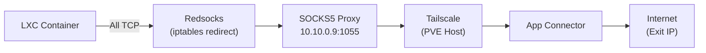

# PVE Tailscale App Connectors for LXCs

Enable Proxmox LXC containers to use **Tailscale App Connectors** without installing Tailscale in each container.

## How It Works



**Solution**: 
1. PVE Host runs Tailscale with SOCKS5 proxy on `10.10.0.9:1055`
2. LXC containers run **redsocks** to transparently redirect ALL TCP traffic
3. Traffic exits through your configured App Connector

---

## Quick Setup

### 1. Run the Setup Script on PVE Host

```bash
# Full setup (configures host + creates hook script)
./setup_tailscale_lxc.sh

# Attach hook to an existing LXC or template
./setup_tailscale_lxc.sh --attach <VMID>
```

### 2. Clone from Template

Any LXC cloned from a template with the hook attached will automatically:
- Route all TCP through the SOCKS5 proxy
- Use App Connector exit IPs for configured domains

### 3. Verify

```bash
# Inside any hooked LXC
curl https://api.ipify.org
# Returns: App Connector exit IP (e.g., 138.3.208.36)
```

---

## What the Script Does

| Component | Configuration |
|-----------|---------------|
| **Tailscale** | `--accept-routes=true --accept-dns=true` |
| **SOCKS5 Proxy** | `/etc/systemd/system/tailscaled.service.d/socks5.conf` → port 1055 |
| **dnsmasq** | Forwards DNS to MagicDNS (`100.100.100.100`) |
| **Hook Script** | `/var/lib/vz/snippets/tailscale-hook.sh` |

### Hook Script Actions (per LXC)
1. Adds route for `100.64.0.0/10` via PVE host
2. Sets DNS to PVE host
3. Installs & configures **redsocks** for transparent TCP proxying
4. Sets up iptables rules to redirect all outbound TCP

---

## Files Reference

| File | Purpose |
|------|---------|
| [`setup_tailscale_lxc.sh`](./setup_tailscale_lxc.sh) | Main setup script |
| `/var/lib/vz/snippets/tailscale-hook.sh` | Hook script (on PVE host) |
| `/etc/redsocks.conf` | Redsocks config (in LXC) |
| `/usr/local/bin/redsocks-fw.sh` | iptables rules (in LXC) |

---

## Important Notes

> [!WARNING]
> **Do NOT enable `--accept-routes`** if another node advertises your LAN subnet (e.g., `10.10.0.0/16`). This causes routing loops.

> [!NOTE]
> The first boot of a new LXC will install redsocks (~5 seconds additional startup time).
