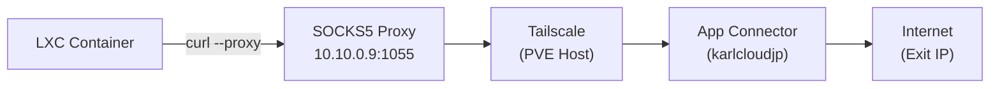

# Guide: Enabling Tailscale App Connectors for Proxmox LXCs (No Client Required)

## Executive Summary
This guide explains how to allow **all** your Proxmox LXC containers to use **Tailscale App Connectors** (routing traffic to specific domains via specific exit nodes) **without installing Tailscale inside each LXC**.

**Mechanism**:
1.  **Traffic**: PVE Host routes LXC traffic into the Tailnet (Subnet Router).
2.  **Resolution (The Key)**: App Connectors work by DNS hijacking (returning `100.x.y.z` IPs). LXCs must use a DNS server that "sees" these mappings. We will configure the PVE Host to forward DNS queries from LXCs to Tailscale.

### How it works for default LXCs (vmbr0)
Your default LXCs live on `vmbr0` (the 10.10.0.0/16 network). They are "next to" the PVE host.
1.  **DNS Query**: LXC asks PVE Host (`10.10.0.9`) "Where is target.com?".
2.  **PVE Response**: PVE (running our modified dnsmasq) asks Tailscale, which replies "It's at 100.x.y.z" (Magic IP).
3.  **Traffic Flow**: LXC sends traffic to `100.x.y.z`.
4.  **Routing**:
    *   **IF** LXC Gateway is PVE (`10.10.0.9`): PVE immediately routes it into the Tailscale tunnel. **(Recommended)**
    *   **IF** LXC Gateway is Router (`10.10.0.1`): Router sends it BACK to PVE (requires Static Route on Router).

---

## Part 1: Prerequisites
1.  **Proxmox Host** is part of your Tailnet.
2.  **App Connectors** are already configured in your Tailscale Admin Console (e.g., `github.com` routed via `node-us-east`).
3.  **Verified** internal network subnet: `10.10.0.0/16` and PVE Host IP: `10.10.0.9`.
4.  **Verified** `dnsmasq` is installed and running on the host (serving `vmbr1`). We will extend it to serve `vmbr0`.

---

## Part 2: Configure PVE Host as Subnet Router
*If you have already done this, skip to Part 3.*

1.  **Enable IP Forwarding** on PVE Host:
    ```bash
    echo 'net.ipv4.ip_forward = 1' | tee -a /etc/sysctl.d/99-tailscale.conf
    echo 'net.ipv6.conf.all.forwarding = 1' | tee -a /etc/sysctl.d/99-tailscale.conf
    sysctl -p /etc/sysctl.d/99-tailscale.conf
    ```

2.  **Configure Routing & Masquerading**:
    Since you already have `tailscale02` advertising the subnet, we **should not** advertise it again on this host to avoid conflict/asymmetry. Instead, we will **Masquerade (NAT)** traffic leaving the PVE host into Tailscale.
    This ensures traffic from LXCs looks like it comes from the PVE Host itself, so responses come back here correctly.

    *Run this to add the NAT rule (and persist it)*:
    ```bash
    # 1. Enable IP Forwarding (if not already done)
    echo 'net.ipv4.ip_forward = 1' | tee -a /etc/sysctl.d/99-tailscale.conf
    sysctl -p /etc/sysctl.d/99-tailscale.conf

    # 2. Add IPTables Rule for Masquerading
    iptables -t nat -A POSTROUTING -o tailscale0 -j MASQUERADE
    
    # 3. Install iptables-persistent to save it
    apt update && apt install iptables-persistent -y
    netfilter-persistent save
    ```

3.  **Start Tailscale (Client Mode)**:
    ```bash
    tailscale up --accept-dns=true
    ```
    *Note: We do NOT need `--advertise-routes` here because we are using NAT.*

---

## Part 3: Configure DNS Forwarding on PVE Host (The Trick)
All LXCs need to use Tailscale's DNS (100.100.100.100) to "see" the App Connectors. We will install `dnsmasq` on the Host to listen on the LAN IP and forward requests to Tailscale.

1.  **Install dnsmasq**:
    ```bash
    apt update && apt install dnsmasq -y
    ```

4.  **Configure dnsmasq**:
    Create/Edit `/etc/dnsmasq.d/01-tailscale.conf`.
    *Critically, we add `interface=vmbr0` so dnsmasq listens on your main network.*
    ```ini
    # Listen on vmbr0 so standard LXCs can query 10.10.0.9
    interface=vmbr0
    
    # Forward EVERYTHING to Tailscale's MagicDNS
    # This ensures App Connectors AND MagicDNS hostnames work for configured LXCs
    server=100.100.100.100
    
    # Never forward plain names (optional, good practice)
    domain-needed
    bogus-priv
    ```

3.  **Restart dnsmasq**:
    ```bash
    systemctl restart dnsmasq
    ```
    *Check status with `systemctl status dnsmasq`.*
    *Note: This will also make `vmbr1` (existing NAT network) use Tailscale DNS, which is generally fine.*

---

## Part 4: The "Resilient" Solution (Automated DHCP)
You want to use **DHCP** (so LXC creation is easy/default) but still allow the LXC to route App Connectors correctly. We can achieve this using a **Hook Script**.

This script runs automatically when the LXC starts. It lets the Router (`10.10.0.1`) assign the IP, but then injects the specific Routes and DNS needed for Tailscale.

### 1. Create the Hook Script
Run this on your PVE Host terminal:
```bash
mkdir -p /var/lib/vz/snippets

cat << 'EOF' > /var/lib/vz/snippets/tailscale-hook.sh
#!/bin/bash
vmid="$1"
phase="$2"

if [[ "$phase" == "post-start" ]]; then
    echo "[$vmid] Tailscale Hook: Configuring routes and DNS..."
    
    # Wait for network to be ready inside LXC
    sleep 3
    
    # 1. Add Static Route for Tailscale Subnet (100.64.0.0/10 -> PVE Host 10.10.0.9)
    # This prevents the traffic from going to the Router (10.10.0.1) which would drop it.
    lxc-attach -n $vmid -- ip route add 100.64.0.0/10 via 10.10.0.9
    
    # 2. Force DNS to PVE Host (10.10.0.9)
    # This ensures resolving 'github.com' returns the MagicDNS IP (100.x.y.z)
    lxc-attach -n $vmid -- bash -c "echo 'nameserver 10.10.0.9' > /etc/resolv.conf"
    
    echo "[$vmid] Tailscale Hook: Done."
fi
EOF

chmod +x /var/lib/vz/snippets/tailscale-hook.sh
```

### 2. Apply to an LXC
When you create a new LXC (e.g., ID `105`) using standard DHCP settings:

1.  Create the LXC as normal (Network: DHCP).
2.  Run **one command** on the PVE Host to enable the magic:
    ```bash
    pct set 105 -hookscript local:snippets/tailscale-hook.sh
    ```
    *(Replace `105` with your LXC ID)*
3.  Start the LXC.

### Verify
Inside the LXC (`pct enter 105`):
-   `ip route`: Should show `100.64.0.0/10 via 10.10.0.9`.
-   `cat /etc/resolv.conf`: Should show `nameserver 10.10.0.9`.
-   `curl target-domain.com`: Should work via App Connector.

---

## Part 5: Manual Static IP (Legacy Method)
*Use this ONLY if you don't want to use the script above.*
**Crucial Note**: Since your home router (`10.10.0.1`) manages DHCP, **you cannot simply select "DHCP"** in the LXC settings.
*   *Why?* DHCP will assign the Router (`10.10.0.1`) as the Gateway and DNS. This breaks App Connectors because the Router doesn't know how to resolve/route Tailscale traffic.
*   **Solution**: You must use **Static IPv4** settings for these LXCs.

### Configuration Steps
1.  **Shutdown** the LXC.
2.  Go to **Resources -> Network**.
    -   **Bridge**: `vmbr0`
    -   **IPv4**: Select **Static** (Do NOT use DHCP).
    -   **IPv4/CIDR**: Pick an IP *outside* your Router's DHCP pool (e.g., `10.10.0.200/16`).
    -   **Gateway (IPv4)**: `10.10.0.9` (**PVE Host IP** - Required).
    -   **DNS Server**: `10.10.0.9` (**PVE Host IP** - Required).
3.  **Start** the LXC.

---

## Part 5: Verification

Inside an LXC (without Tailscale installed):

1.  **Test DNS**:
    ```bash
    # Should return a 100.x.y.z IP (Tailscale CGNAT), NOT the public IP
    nslookup target-domain.com
    ```

2.  **Test Connectivity**:
    ```bash
    # Should work
    curl -v target-domain.com
    ```

---

## Part 6: SOCKS5 Proxy Solution (Recommended)

> [!IMPORTANT]
> **Key Finding**: The DNS hijacking approach (Parts 3-5) does NOT work for App Connectors. Tailscale App Connectors use **route-based mode**, NOT DNS hijacking. They advertise IP routes, but forwarded traffic from LXCs does not enter the Tailscale tunnel correctly.

### The Working Solution: SOCKS5 Proxy

Configure Tailscale on the PVE host to run a SOCKS5 proxy, then route LXC traffic through it.



### 1. Configure Tailscale Daemon with SOCKS5 Proxy

Create a systemd override:
```bash
mkdir -p /etc/systemd/system/tailscaled.service.d
cat > /etc/systemd/system/tailscaled.service.d/socks5.conf << 'EOF'
[Service]
ExecStart=
ExecStart=/usr/sbin/tailscaled --state=/var/lib/tailscale/tailscaled.state --socket=/run/tailscale/tailscaled.sock --port=41641 --socks5-server=10.10.0.9:1055 --outbound-http-proxy-listen=10.10.0.9:1055
EOF
systemctl daemon-reload
systemctl restart tailscaled
```

### 2. Enable Accept-Routes

**CRITICAL**: App Connector routes must be accepted:
```bash
tailscale set --accept-routes=true
```

> [!WARNING]
> Do NOT enable `--accept-routes` if another node (e.g., `tailscale02`) is advertising your LAN subnet (e.g., `10.10.0.0/16`). This causes routing loops. Disable conflicting subnet advertisements first.

### 3. Usage in LXCs

**For curl** (explicit proxy required):
```bash
curl --proxy socks5://10.10.0.9:1055 https://api.ipify.org
# Returns: App Connector exit IP (e.g., 138.3.208.36)
```

**For applications respecting env vars** (apt, wget, pip, npm):
```bash
export ALL_PROXY=socks5://10.10.0.9:1055
export HTTP_PROXY=http://10.10.0.9:1055
export HTTPS_PROXY=http://10.10.0.9:1055
```

### 4. Automated Hook Script

The hook script at `/var/lib/vz/snippets/tailscale-hook.sh` can inject these environment variables automatically. See [`setup_tailscale_lxc.sh`](./setup_tailscale_lxc.sh) for the complete automated setup.

---

## Key Findings & Limitations

| Approach | Works? | Notes |
|----------|--------|-------|
| DNS Hijacking via dnsmasq | ❌ | App Connectors don't return MagicDNS IPs |
| Route-based (accept-routes) | ❌ | Forwarded traffic doesn't enter Tailscale tunnel |
| Advertise LXC subnet | ❌ | Causes routing loop if PVE is inside subnet |
| **SOCKS5 Proxy** | ✅ | Traffic originates from tailscaled, properly routed |

### Root Cause
Tailscale's policy routing (fwmark `0x80000`) only applies to **locally-originated** traffic. Forwarded packets from LXCs bypass this, going straight to the default route.
